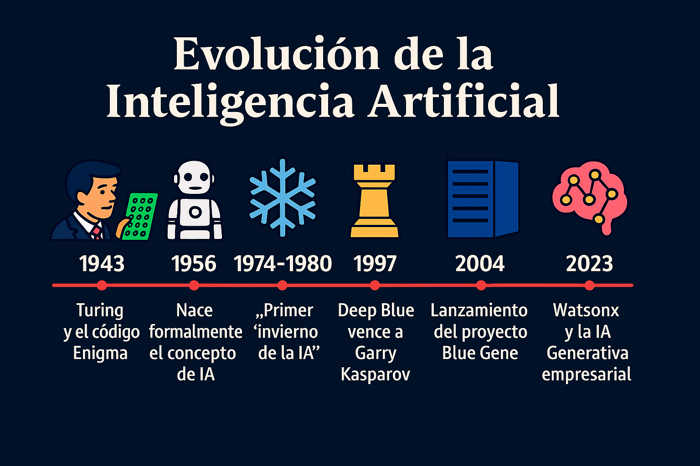
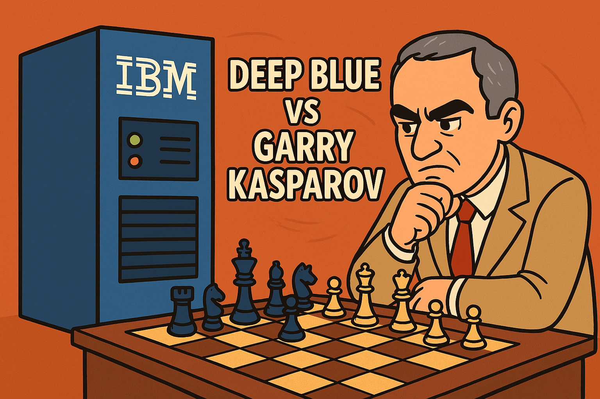
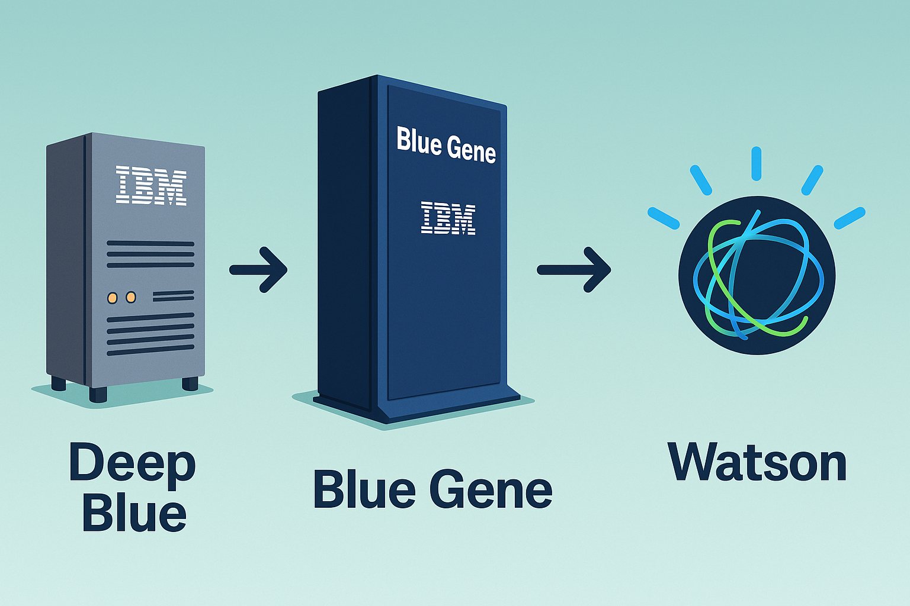

# La evolución de la Inteligencia Artificial: Del código Enigma a la era de la IA Generativa

La historia de la inteligencia artificial está marcada por hitos que transformaron no solo la tecnología, sino también la manera en que nos relacionamos con las máquinas.

<figure>

<figcaption>Fig 1. Linea de tiempo de la evolución de la IA.</figcaption>
</figure>

Todo comenzó en los años 40, cuando en 1943 **Warren McCulloch y Walter Pitts** proponen el primer modelo matemático de una red neuronal artificial llamado **MCP**. El cual es un modelo matemático de una neurona biológica. El modelo MCP también se conoce como unidad lógica de umbral. Posteriormente, entre los años de 1945 a 1946 **Alan Turing** lideró el descifrado del código **Enigma** durante la Segunda Guerra Mundial. Este fue el primer gran paso hacia lo que hoy entendemos como pensamiento computacional e inteligencia automatizada.

Décadas más tarde, y tras un largo período de avances lentos y falta de inversión conocido como el **"invierno de la IA"**, **IBM** revolucionó el campo con un momento que marcaría un antes y un después.

## Deep Blue vs. Garry Kasparov: El momento que cambió la historia

En mayo de 1997, el mundo fue testigo de un evento sin precedentes: una máquina derrotó por primera vez a un campeón mundial de ajedrez en una serie oficial. El protagonista fue **Deep Blue**, la supercomputadora desarrollada por IBM, que venció al gran maestro ruso **Garry Kasparov**, considerado uno de los mejores ajedrecistas de todos los tiempos.

<figure>

<figcaption>Fig 2. Deep Blue vs Garry Kasparov.</figcaption>
</figure>

La serie consistió en **seis partidas**. Deep Blue ganó **dos**, Kasparov ganó **una**, y empataron **tres**. La victoria fue decisiva en la sexta partida, cuando Deep Blue jugó con una agresividad que incluso hizo pensar a Kasparov que la máquina debía haber recibido ayuda humana.

Lo revolucionario fue que Deep Blue no usaba aprendizaje automático como las IAs modernas; utilizaba **fuerza bruta computacional**, evaluando hasta **200 millones de posiciones por segundo**, basándose en una vasta base de datos de partidas históricas y heurísticas avanzadas.

Este evento fue un punto de inflexión: por primera vez, una máquina vencía al intelecto humano en un terreno considerado el pináculo de la lógica y el razonamiento estratégico.

Deep Blue demostró que las máquinas podían superar a los humanos en dominios específicos, abriendo el camino a nuevas generaciones de sistemas inteligentes como **Blue Gene**, **Watson** y más recientemente **Watsonx**.

## De Deep Blue a Blue Gene

De **Deep Blue** nació una nueva visión: no solo máquinas que juegan, sino que ayudan a resolver problemas complejos del mundo real. Así nació el proyecto **Blue Gene**, una iniciativa que impulsó la supercomputación a niveles sin precedentes.

A diferencia de Deep Blue, diseñada para una tarea específica, Blue Gene fue concebida para investigar temas como:
- Biología molecular
- Simulación de proteínas
- Modelado de enfermedades

**Blue Gene no solo elevó la capacidad de procesamiento, sino que preparó el camino para algo aún más ambicioso: IBM Watson.**

<figure>

<figcaption>Fig 3. De Deep Blue a Blue Gene finalizando en Watson.</figcaption>
</figure>

## El nacimiento de Watson

En 2011, **Watson** sorprendió al mundo venciendo a los campeones humanos del programa **Jeopardy!**. Esta vez no con fuerza bruta computacional, sino con algo mucho más humano:
- Comprensión del **lenguaje natural**
- Análisis semántico
- Interpretación de preguntas ambiguas y referencias culturales

Watson representaba el nacimiento de la **IA cognitiva**.

Posteriormente, Watson se adaptó a industrias como salud, banca y gobierno, ayudando en la toma de decisiones complejas, análisis de datos no estructurados y mejora de la atención al cliente.

## Microsoft lanza Azure Machine Learning
En 2015, **Microsoft** lanzó **Azure Machine Learning**, una plataforma que democratizó el acceso a la inteligencia artificial. Azure Machine Learning permitió a empresas de todos los tamaños crear, entrenar y desplegar modelos de machine learning en la nube, facilitando la adopción de la IA en diversas industrias. 

Posteriormente, en 2016 **Microsoft** lanzó **Azure Cognitive Services**, una colección de APIs y servicios que permitieron a los desarrolladores integrar capacidades de inteligencia artificial en sus aplicaciones sin necesidad de ser expertos en machine learning. Esto marcó un hito en la accesibilidad de la IA, permitiendo a empresas de todos los tamaños aprovechar el poder del aprendizaje automático y la inteligencia artificial en sus operaciones diarias. Y en 2019, **Microsoft** anuncia alianza con **OpenAI**, con una inversión de $1 mil millones para impulsar la **IA responsable** y con esto llevar la IA a un nuevo nivel, integrando modelos de lenguaje avanzados en sus productos y servicios.

Con esto, en el año 2021, **Microsoft** lanza **Azure OpenAI Service**, permitiendo a los desarrolladores acceder a modelos de lenguaje avanzados como **GPT-3 y DALL-E** a través de la plataforma **Azure**. Esto marcó un hito en la democratización de la IA generativa, permitiendo a las empresas crear aplicaciones innovadoras y personalizadas utilizando modelos de lenguaje de última generación.

Para 2023, **Microsoft** lanza **Copilot**, una herramienta que integra **IA generativa** en aplicaciones de productividad como **Word y Excel**, permitiendo a los usuarios generar contenido, automatizar tareas y mejorar la eficiencia en su trabajo diario. Esto representa un avance significativo en la forma en que las personas interactúan con la tecnología, haciendo que la IA sea una parte integral de su flujo de trabajo diario. Y en el mismo año **Microsoft** lanza **GitHub Copilot**, una herramienta que utiliza IA generativa para ayudar a los desarrolladores a escribir código de manera más eficiente, sugiriendo fragmentos de código y completando tareas repetitivas. Esto marca un avance significativo en la forma en que los desarrolladores interactúan con la tecnología, haciendo que la IA sea una parte integral de su flujo de trabajo diario.

## Oracle Cloud Infrastructure: IA optimizada para el rendimiento empresarial

Con los avances expuestos, **Oracle** no se podía quedar atras, sin embargo, ha abordado la inteligencia artificial desde una perspectiva diferente, centrada en la integración de IA en aplicaciones empresariales críticas y la optimización del rendimiento en la nube. Con **Oracle Cloud Infrastructure (OCI)**, la compañía ha desarrollado un entorno de cómputo de alto desempeño que facilita el entrenamiento y la inferencia de modelos de IA de forma rentable y escalable.

OCI incluye servicios como **OCI Data Science**, que permite a los científicos de datos crear y desplegar modelos de aprendizaje automático, y **OCI AI Services**, que proporciona modelos preentrenados para visión por computadora, análisis de texto, reconocimiento de voz y más. Estos servicios están orientados a resolver problemas específicos del mundo real en **áreas como finanzas, logística, recursos humanos y salud**.

Uno de los diferenciadores clave de Oracle es su **enfoque en el costo/rendimiento y la interoperabilidad** con herramientas de código abierto como **TensorFlow, PyTorch y scikit-learn**. Además, ha incorporado IA dentro de su **Oracle Autonomous Database**, permitiendo optimizaciones automáticas sin intervención humana.

Para el año 2023, Oracle lanza **Oracle Database 23ai**, una versión que integra capacidades de IA generativa y aprendizaje automático directamente en la base de datos, permitiendo a los desarrolladores y científicos de datos crear aplicaciones más inteligentes y eficientes. Esta versión incluye mejoras en la automatización de tareas, optimización de consultas y análisis predictivo, lo que facilita la toma de decisiones basada en datos en tiempo real. Con esto, Oracle da una introducción del **AI Select** que permite a los usuarios realizar consultas en lenguaje natural y obtener resultados precisos y relevantes, mejorando la experiencia del usuario y facilitando el acceso a la información.

## La era de la IA Generativa y la llegada de Watsonx

Hoy vivimos una nueva etapa: la de la **IA Generativa** y los **modelos fundacionales**. En este contexto, **IBM lanza Watsonx**, una plataforma empresarial diseñada para crear, escalar y gobernar soluciones de inteligencia artificial de manera responsable y eficiente.

### ¿Qué es Watsonx?

Watsonx es una suite que combina:
- **watsonx.ai**: el estudio de desarrollo de modelos fundacionales e IA generativa.
- **watsonx.data**: una plataforma de datos preparada para IA, optimizada para analítica y gobernanza.
- **watsonx.governance**: herramientas para gobernar el uso de modelos de IA, enfocados en cumplimiento y confianza.

## IBM Watsonx Assistant

Dentro de esta evolución destaca **Watsonx Assistant**, una solución empresarial que permite construir asistentes virtuales y chatbots inteligentes con capacidades avanzadas de comprensión y respuesta en lenguaje natural.

Watsonx Assistant permite:
- Integrar conversaciones multicanal (web, móvil, mensajería, voz).
- Entrenar con datos específicos del negocio.
- Brindar experiencias más naturales, precisas y contextualizadas.
- Escalar de forma segura bajo principios de privacidad y trazabilidad.

Todo esto con el respaldo de modelos entrenados con datos empresariales, gobernanza robusta y adaptabilidad a múltiples industrias.

## Conclusión

De **Enigma a Watsonx**, pasando por **Deep Blue**, **Blue Gene**, **Azure OpenAI Service**, **Microsoft Copilot y GitHub Copilot**, **OCI AI Services**, **Oracle AI Select** y **Watson**, la historia de la inteligencia artificial no es solo una línea de código, es una línea de evolución.

Una evolución que no busca reemplazar al ser humano, sino **potenciar su pensamiento, decisiones y creatividad**.

La IA ha dejado de ser una promesa del futuro, para convertirse en un aliado estratégico del presente.