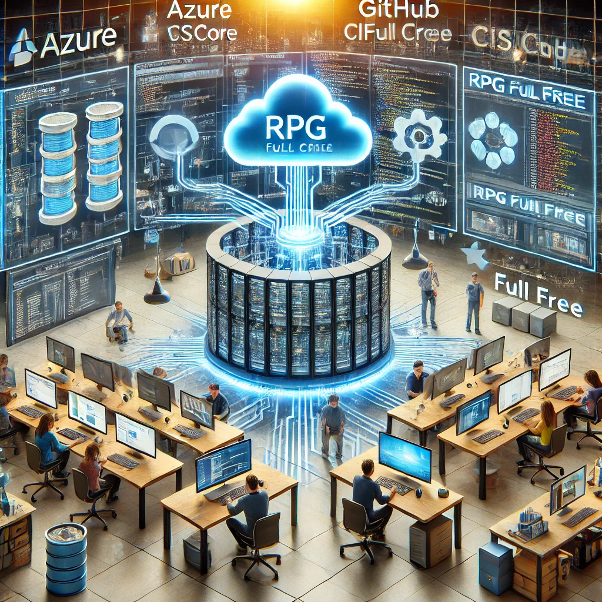
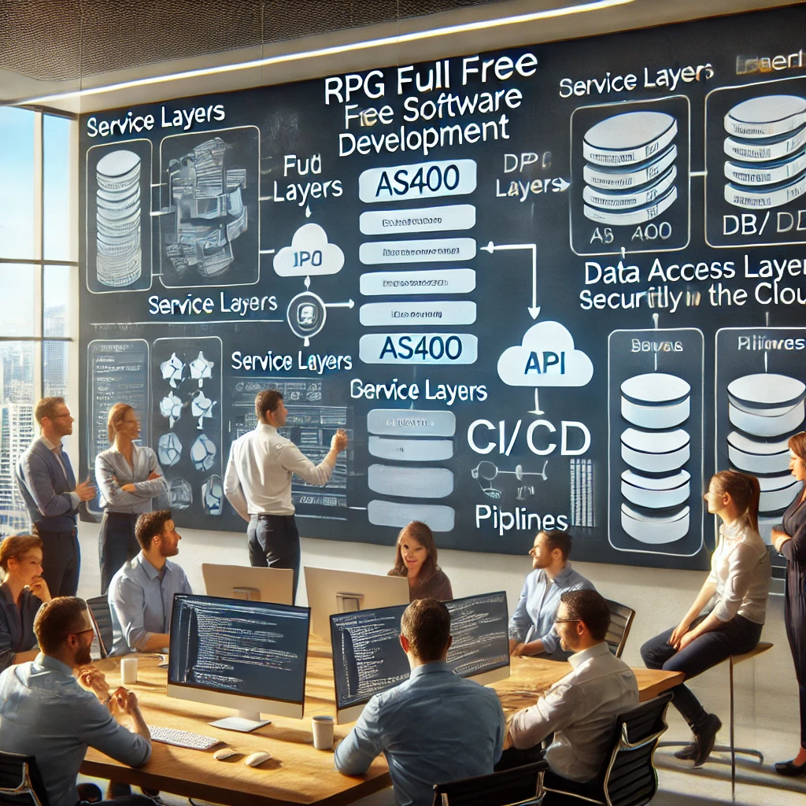

# 🔥 La Evolución del RPG: Full Free en Arquitecturas Modernas 🚀  

El lenguaje **RPG** ha sido la columna vertebral de los sistemas IBM i durante décadas. Aunque muchos lo consideran "antiguo", la realidad es que **ha evolucionado enormemente**, adaptándose a las necesidades de las arquitecturas modernas.  

Hoy en día, con **RPG Full Free + VS Code**, podemos desarrollar de forma más ágil, modular y escalable, integrando **APIs, microservicios, cloud computing y DevOps**.  

<figure>

<figcaption>Fig 1. La evolución del RPG con repositorios en la nube y multiples equipos de trabajo colaborativo.</figcaption>
</figure>

## 🔹 La evolución de RPG con Full Free  

Con la llegada de **RPG Full Free**, las limitaciones del formato fijo desaparecieron, permitiendo un código más limpio y alineado con los estándares modernos.  

### 🔥 Ejemplo de definición de variables en RPG antiguo vs. Full Free  

**Antes (formato fijo, SEU o RDi)**:  
```rpg
D Nombre         S             50A
D Edad           S              3 0
D Salario        S              9 2
```

**Ahora (Full Free en VS Code)**:  
```rpg
dcl-s nombre varchar(50);
dcl-s edad int(3);
dcl-s salario dec(9:2);
```
✅ **Más legible, sin restricciones de columnas y alineado con lenguajes modernos.**  

<figure>

<figcaption>Fig 2. Desarrollos en AS400 por medio de equipos ágiles en arquitecturas modernas.</figcaption>
</figure>

## 🔹 Arquitecturas Modernas con Full Free + VS Code  

Históricamente, IBM i ha sido visto como un sistema monolítico, pero con **RPG Full Free**, ahora podemos diseñar soluciones **modulares, escalables y conectadas con la nube**.  

### ☁️ 1️⃣ APIs REST y Web Services con RPG Full Free  

🔥 **Ejemplo de creación de un objeto JSON con RPG Full Free**  
```rpg
dcl-s jsonData clob(1M);
dcl-s nombre varchar(50);
dcl-s edad int(3);

exec sql
   select JSON_OBJECT('nombre' VALUE nombre, 'edad' VALUE edad)
   into :jsonData
   from clientes
   where id = 1001;

dsply jsonData;
```
✅ **Ideal para exponer datos de IBM i en APIs REST.**  


### 🔗 2️⃣ Microservicios en IBM i con RPG Full Free  

Con **RPG Full Free + Web Services**, podemos:  
✅ Exponer lógica de negocio en servicios RESTful.  
✅ Integrar RPG con **Node.js, Python o Java** para manejar interfaces web.  
✅ Usar **contenedores Docker** para desplegar APIs RPG en entornos híbridos.  

🔥 **Ejemplo de un microservicio con RPG Full Free y JSON**  
```rpg
dcl-s requestJSON clob(1M);
dcl-s responseJSON clob(1M);

requestJSON = '{
  "accion": "obtenerCliente",
  "idCliente": 1001
}';

exec sql
   set :responseJSON = JSON_OBJECT('status' VALUE 'success',
                                   'data' VALUE JSON_QUERY(requestJSON, '$'));

dsply responseJSON;
```
✅ **Aquí procesamos una petición JSON y generamos una respuesta estructurada, ideal para microservicios en IBM i.**  


### 📡 3️⃣ Conectividad con la Nube: Azure, AWS e IBM Cloud  

Con **RPG Full Free + VS Code**, podemos conectar IBM i con la nube para:  

☁️ **Enviar y recibir datos desde Azure Blob Storage, AWS S3 o IBM Cloud Object Storage.**  
☁️ **Autenticar usuarios con OAuth2 y JWT.**  
☁️ **Consumir servicios web externos mediante HTTP.**  

🔥 **Ejemplo: Consumo de un servicio en la nube con RPG Full Free y HTTP**  
```rpg
dcl-s url varchar(256) inz('https://api.servicio.com/cliente');
dcl-s jsonRequest clob(1M);
dcl-s jsonResponse clob(1M);

jsonRequest = '{ "idCliente": 1001 }';

exec sql
   call QSYS2.HTTP_POST(url, 'application/json', jsonRequest, jsonResponse);

dsply jsonResponse;
```
✅ **Este código muestra cómo IBM i puede interactuar con servicios externos mediante APIs.**  


### 🔄 4️⃣ Integración con DevOps: GitHub y Azure DevOps  

🔥 **Ejemplo de flujo de trabajo con Git y CI/CD en RPG Full Free**  
1️⃣ **Escribimos código en VS Code con Code for IBM i.**  
2️⃣ **Subimos cambios a GitHub o Azure Repos con Git.**  
3️⃣ **Usamos Hard Code Check for IBM i para validar calidad de código.**  
4️⃣ **Desplegamos automáticamente en IBM i con Azure DevOps.**  

✅ **Con esta estrategia, podemos aplicar metodologías ágiles en RPG Full Free.**  


### 🛠️ 5️⃣ Uso de Procedimientos en RPG Full Free  

Uno de los beneficios de **RPG Full Free** es la capacidad de estructurar mejor el código mediante **procedimientos**, permitiendo:  
✅ **Modularidad**: Separar la lógica en componentes reutilizables.  
✅ **Mantenimiento**: Facilitar cambios sin afectar otras partes del sistema.  
✅ **Reutilización**: Evitar código duplicado y mejorar eficiencia.  

🔥 **Ejemplo de Procedimiento en RPG Full Free**  

**Definición del procedimiento:**  
```rpg
dcl-proc calcularTotal;
   dcl-pi *n packed(9:2);
   dcl-parm cantidad packed(5:0);
   dcl-parm precio packed(7:2);
   return cantidad * precio;
end-proc;
```

**Uso del procedimiento en un programa:**  
```rpg
dcl-s total packed(9:2);

total = calcularTotal(5 : 19.99);
dsply ('Total: ' + %char(total));
```
✅ **Este procedimiento permite calcular el total de una compra, manteniendo el código limpio y reutilizable.**  

## 🔥 Conclusión  

💡 **IBM i sigue evolucionando y RPG Full Free se adapta perfectamente a arquitecturas modernas.**  
💡 **El uso de procedimientos en RPG mejora la modularidad, reutilización y mantenimiento del código.**  
💡 **VS Code potencia el desarrollo, integración con APIs, DevOps y la nube.**  

🌍 **¿Cómo estás usando RPG Full Free en arquitecturas modernas? ¿Has probado integraciones con VS Code, DevOps o AI?** ¡Déjamelo en los comentarios! 👇 