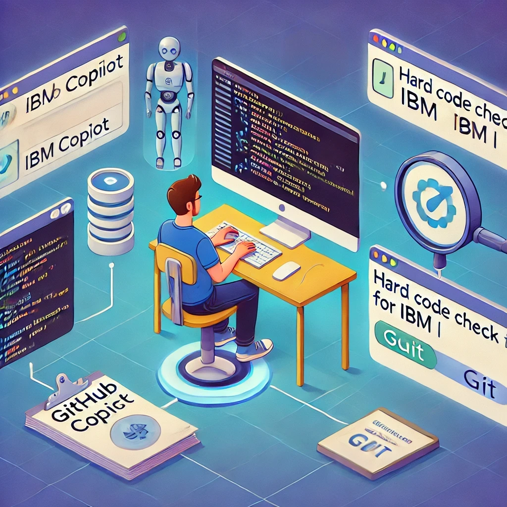
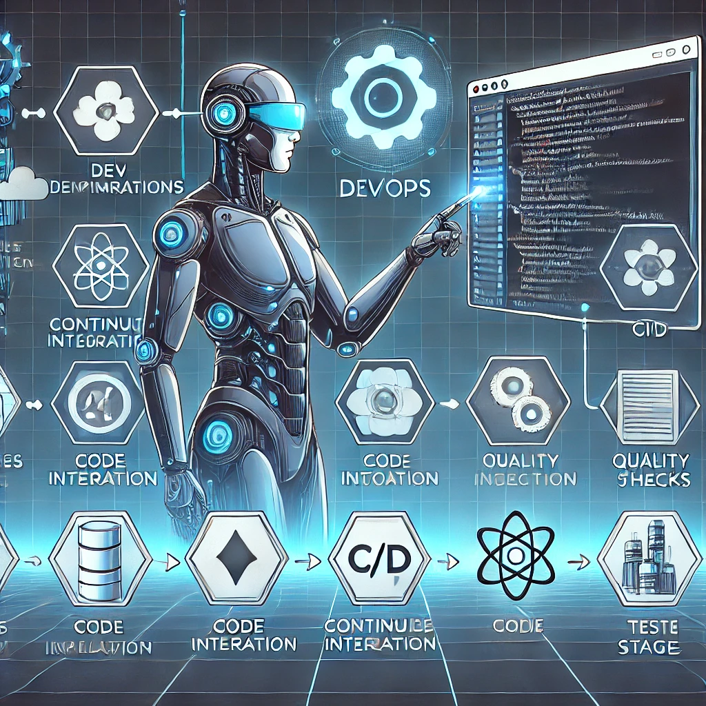

# Optimizing CI on IBM i with Full Free: Continuous Deployment with AI and DevOps

Automating the development flow is key to improving the quality and delivery speed of software. In **IBM i** environments, where traditional practices still prevail, implementing **Continuous Integration (CI)** can be a challenge, but also a great optimization opportunity.

In this article, we will explore how to accelerate development on **IBM i with Full Free RPG** through **DevOps and Artificial Intelligence (AI)** tools, such as **GitHub Copilot** and **Hard Code Check for IBM i**.

<figure>

<figcaption>Fig 1. CI optimization chart on IBM i.</figcaption>
</figure>

## What is Continuous Deployment on IBM i?
**Continuous Integration (CI)** is a practice within **DevOps** that automates the integration of code into a central repository, enabling:

✅ **Early detection of errors** in the code.  
✅ **Test automation** to reduce defects.  
✅ **Better collaboration and code review** in development teams.  
✅ **Faster and more reliable delivery** of new versions.

In **IBM i** environments, the adoption of **CI/CD** is increasingly relevant due to the need to **integrate legacy systems with modern architectures**.


## CI challenges on IBM i with Full Free RPG
Full Free RPG has modernized programming on IBM i, making the transition toward more open and readable standards easier. However, development teams still face challenges such as:

❌ **Lack of native tools** for automated integration and deployment.  
❌ **Dependence on manual processes** for code validation.  
❌ **Use of legacy practices** that slow down implementation.

<figure>

<figcaption>Fig 2. AI supporting DevOps.</figcaption>
</figure>
This is where **AI and DevOps** tools can make the difference.


## CI/CD pipeline on IBM i with GitHub Copilot, Hard Code Check, and GitHub
To implement an **efficient CI flow on IBM i**, we can rely on tools that optimize code quality and its integration into version-control repositories. An ideal flow would include:

- **GitHub Copilot** to assist in writing Full Free RPG code within **VS Code**.  
- **Hard Code Check for IBM i** to detect rigid code or bad practices before integration.  
- **VS Code** as the development environment, making integration with DevOps tools easier.  
- **GitHub or Azure Repos** to version the code and collaborate as a team efficiently.  

### Optimized pipeline on IBM i

The workflow would look like this:

1. **The programmer develops in VS Code with GitHub Copilot**, receiving intelligent code suggestions.  
2. **The code goes through Hard Code Check for IBM i**, detecting bad practices and ensuring quality.  
3. **If the code passes the validations, a commit is made to a Git repository** (GitHub or Azure Repos).  
4. **A code review is performed in the repository**, ensuring it meets standards before its integration into the main branch.  
5. **The code is ready to be compiled and deployed on IBM i** safely.

### CI flow on IBM i with GitHub Copilot and Hard Code Check


## Accelerating Development with GitHub Copilot
GitHub Copilot, powered by **OpenAI**, has proven to be a great ally for developers, including those who work with **IBM i**. Some of its advantages include:

✅ **Autocompletion of Full Free RPG code**, speeding up writing and reducing errors.  
✅ **Contextual suggestions based on previous code**, which improves quality and consistency.  
✅ **Generation of reusable snippets** for common functions on IBM i.

### Example of code optimized with GitHub Copilot

```rpg
**free
ctl-opt dftactgrp(*no) actgrp(*new);
ctl-opt option(*srcstmt);

dcl-ds Customer extname('CUSTOMERS') qualified end-ds;

dcl-proc GetCustomerData;
   dcl-pi *n end-pi;

   dcl-s customerID int(10);
   dcl-s customerName varchar(50);
   dcl-s customerEmail varchar(50);

   exec sql
      DECLARE c1 CURSOR FOR
      SELECT ID, NAME, EMAIL FROM CUSTOMERS;

   exec sql OPEN c1;

   do;
      exec sql FETCH c1 INTO :customerID, :customerName, :customerEmail;
      if sqlstate = '02000'; // No more rows
         leave;
      endif;
      dsply ('ID: ' + %char(customerID) + ' Nombre: ' + customerName + ' Email: ' + customerEmail);
   enddo;

   exec sql CLOSE c1;
end-proc;
```

## Hard Code Check for IBM i: A shield against bad practices
Another key pillar for efficient CI is **code quality**. For IBM i, an effective solution is **Hard Code Check for IBM i**, a **VS Code** extension that helps detect rigid or non-parameterizable code in languages such as **RPGLE, SQLRPGLE, CL, and more**.

### Example of code improved with Hard Code Check

```rpg
**free
dcl-ds ConfigData qualified;
   taxRate packed(5:2);
end-ds;

exec sql
   SELECT TaxRate INTO :ConfigData.taxRate FROM SYSTEM_CONFIG WHERE ID = 1;

dcl-proc CalculateTax;
   dcl-pi *n packed(7:2);
      amount packed(7:2);
   end-pi;

   return amount * ConfigData.taxRate;
end-proc;
```

## Conclusion
The integration of AI and DevOps tools on IBM i is revolutionizing the way we develop software on this platform. **GitHub Copilot** makes writing code easier, while **Hard Code Check for IBM i** ensures that the code meets quality standards before being deployed.

Adopting **CI on IBM i** not only **accelerates development**, but also improves the **quality, security, and scalability** of the software.
