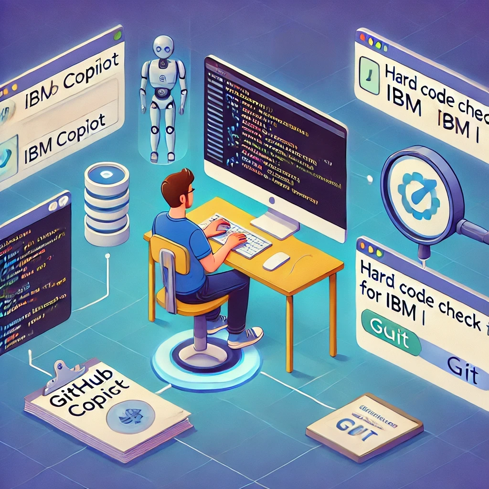
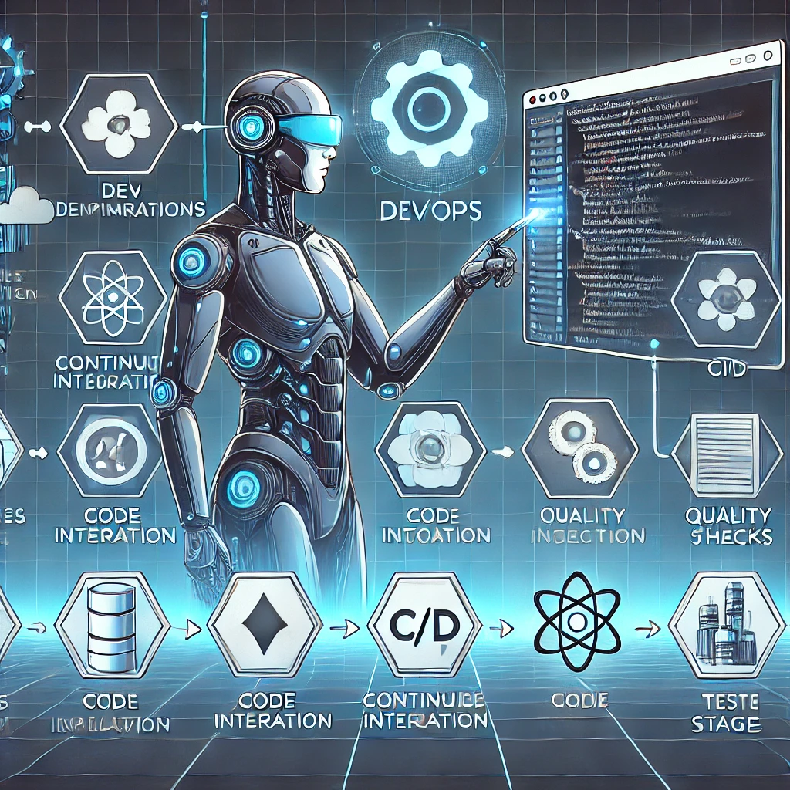

# Optimización del CI en IBM i con Full Free: Implementación Continua con IA y DevOps

La automatización del flujo de desarrollo es clave para mejorar la calidad y velocidad de entrega del software. En entornos **IBM i**, donde aún prevalecen prácticas tradicionales, implementar **Integración Continua (CI)** puede ser un desafío, pero también una gran oportunidad de optimización.

En este artículo, exploraremos cómo acelerar el desarrollo en **IBM i con Full Free RPG** mediante herramientas de **DevOps e Inteligencia Artificial (IA)**, como **GitHub Copilot** y **Hard Code Check for IBM i**.

<figure>

<figcaption>Fig 1. Gráfica de optimización del CI en IBM i.</figcaption>
</figure>

## ¿Qué es la Implementación Continua en IBM i?
La **Implementación Continua (CI)** es una práctica dentro de **DevOps** que automatiza la integración del código en un repositorio central, permitiendo:

✅ **Detección temprana de errores** en el código.  
✅ **Automatización de pruebas** para reducir defectos.  
✅ **Mejor colaboración y revisión de código** en equipos de desarrollo.  
✅ **Entrega más rápida y confiable** de nuevas versiones.

En entornos **IBM i**, la adopción de **CI/CD** es cada vez más relevante debido a la necesidad de **integrar sistemas heredados con arquitecturas modernas**.


## Retos del CI en IBM i con Full Free RPG
Full Free RPG ha modernizado la programación en IBM i, facilitando la transición hacia estándares más abiertos y legibles. Sin embargo, los equipos de desarrollo aún enfrentan desafíos como:

❌ **Falta de herramientas nativas** para integración y despliegue automatizado.  
❌ **Dependencia de procesos manuales** para validación de código.  
❌ **Uso de prácticas heredadas** que ralentizan la implementación.

<figure>

<figcaption>Fig 1. Gráfica de futuro de DevOps con AI.</figcaption>
</figure>
Aquí es donde herramientas de **IA y DevOps** pueden marcar la diferencia.


## Pipeline de CI/CD en IBM i con GitHub Copilot, Hard Code Check y GitHub
Para implementar un flujo de **CI eficiente en IBM i**, podemos apoyarnos en herramientas que optimizan la calidad del código y su integración en repositorios de control de versiones. Un flujo ideal incluiría:

- **GitHub Copilot** para asistir en la escritura de código en Full Free RPG dentro de **VS Code**.  
- **Hard Code Check for IBM i** para detectar código rígido o malas prácticas antes de la integración.  
- **VS Code** como entorno de desarrollo, facilitando la integración con herramientas de DevOps.  
- **GitHub o Azure Repos** para versionar el código y colaborar en equipo de manera eficiente.  

### Pipeline optimizado en IBM i

El flujo de trabajo quedaría de la siguiente manera:

1. **El programador desarrolla en VS Code con GitHub Copilot**, recibiendo sugerencias inteligentes de código.  
2. **El código pasa por Hard Code Check for IBM i**, detectando malas prácticas y asegurando calidad.  
3. **Si el código pasa las validaciones, se hace commit a un repositorio Git** (GitHub o Azure Repos).  
4. **Se realiza una revisión de código en el repositorio**, asegurando que cumpla con estándares antes de su integración a la rama principal.  
5. **El código queda listo para ser compilado y desplegado en IBM i** de manera segura.

### Flujo del CI en IBM i con GitHub Copilot y Hard Code Check


## Acelerando el Desarrollo con GitHub Copilot
GitHub Copilot, impulsado por **OpenAI**, ha demostrado ser un gran aliado para los desarrolladores, incluyendo aquellos que trabajan con **IBM i**. Algunas de sus ventajas incluyen:

✅ **Autocompletado de código Full Free RPG**, agilizando la escritura y reduciendo errores.  
✅ **Sugerencias contextuales basadas en código previo**, lo que mejora la calidad y coherencia.  
✅ **Generación de snippets reutilizables** para funciones comunes en IBM i.

### Ejemplo de código optimizado con GitHub Copilot

```rpg
**free
ctl-opt dftactgrp(*no) actgrp(*new);
ctl-opt option(*srcstmt);

dcl-ds Customer extname('CUSTOMERS') qualified end-ds;

dcl-proc GetCustomerData;
   dcl-pi *n end-pi;

   dcl-s customerID int(10);
   dcl-s customerName varchar(50);
   dcl-s customerEmail varchar(50);

   exec sql
      DECLARE c1 CURSOR FOR
      SELECT ID, NAME, EMAIL FROM CUSTOMERS;

   exec sql OPEN c1;

   do;
      exec sql FETCH c1 INTO :customerID, :customerName, :customerEmail;
      if sqlstate = '02000'; // No more rows
         leave;
      endif;
      dsply ('ID: ' + %char(customerID) + ' Nombre: ' + customerName + ' Email: ' + customerEmail);
   enddo;

   exec sql CLOSE c1;
end-proc;
```

## Hard Code Check for IBM i: Un escudo contra malas prácticas
Otro pilar clave para un CI eficiente es la **calidad del código**. Para IBM i, una solución efectiva es **Hard Code Check for IBM i**, una extensión de **VS Code** que ayuda a detectar código rígido o no parametrizable en lenguajes como **RPGLE, SQLRPGLE, CL, y más**.

### Ejemplo de código mejorado con Hard Code Check

```rpg
**free
dcl-ds ConfigData qualified;
   taxRate packed(5:2);
end-ds;

exec sql
   SELECT TaxRate INTO :ConfigData.taxRate FROM SYSTEM_CONFIG WHERE ID = 1;

dcl-proc CalculateTax;
   dcl-pi *n packed(7:2);
      amount packed(7:2);
   end-pi;

   return amount * ConfigData.taxRate;
end-proc;
```

## Conclusión
La integración de herramientas de IA y DevOps en IBM i está revolucionando la forma en que desarrollamos software en esta plataforma. **GitHub Copilot** facilita la escritura de código, mientras que **Hard Code Check for IBM i** garantiza que el código cumpla con estándares de calidad antes de ser implementado.

Adoptar **CI en IBM i** no solo **acelera el desarrollo**, sino que también mejora la **calidad, seguridad y escalabilidad** del software.
