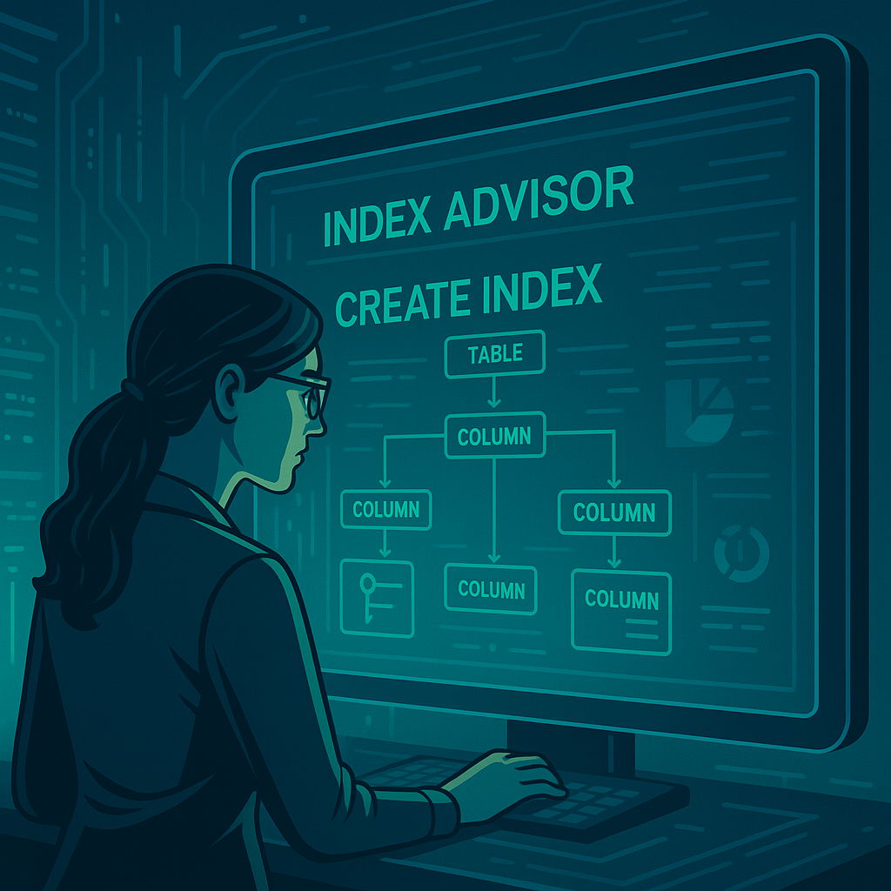
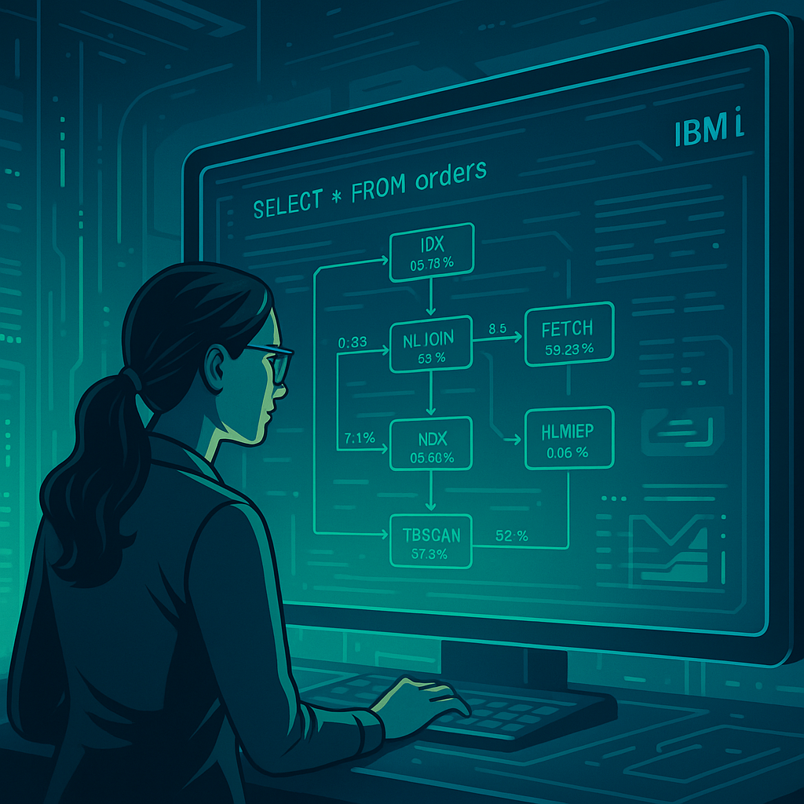

# SQL performance optimization in IBM i: Using Index Advisor and Visual Explain

In enterprise environments that rely on IBM i as their operational backbone, the efficiency of SQL queries is critical. A poorly executed query can impact response times, locks, and ultimately the user experience and overall system performance.

In this article we explore two powerful tools for improving SQL performance in IBM i: **Index Advisor** and **Visual Explain**.

## Why is it important to optimize SQL queries in IBM i?

Although DB2 for i is highly efficient, it is not free from performance problems when queries:
- Do not use appropriate indexes.
- Generate unnecessary _full table scans_.
- Have poorly structured filters or poorly designed joins.

The good news: **IBM i has advanced monitoring and optimization-suggestion tools, with no need for additional software**.

## What is the Index Advisor?

The **Index Advisor** is a DB2 for i feature that suggests **indexes that would improve the performance** of recently executed queries.

<figure>

<figcaption>Fig 1. Index analysis in IBM i.</figcaption>
</figure>

**Where to find it:** You can access it from **IBM Navigator for i**, within the database schema, or by using the system table:

```sql
SELECT * FROM QSYS2.SYSIXADV
WHERE TABLE_SCHEMA = 'MI_BASE_DE_DATOS';
```

You can also filter by a specific table:

```sql
SELECT * FROM QSYS2.SYSIXADV
WHERE TABLE_SCHEMA = 'MI_BASE_DE_DATOS' AND
      SYSTEM_TABLE_NAME = 'NOMBRE_TABLA';
```

**What it shows:**
- Tables that require new indexes.
- Recommended columns.
- Number of times the index was suggested.
- Associated example query.

**Advantages:**
- Suggestions based on real usage.
- Generates the suggested index DDL directly.
- Updates dynamically as queries are executed.

## How to interpret the Index Advisor suggestions?

The **Index Advisor** in IBM i monitors executed queries and detects table-access patterns where an index **would have reduced response time**, based on the analysis of the execution plans generated by the DB2 for i optimizer.

### How to query the suggestions?

```sql
SELECT TABLE_NAME, LEADING_COLUMN_KEYS, TIMES_ADVISED, INDEX_TYPE, 
       SYSTEM_TABLE_SCHEMA, LAST_ADVISED
FROM QSYS2.SYSIXADV
ORDER BY TIMES_ADVISED;
```

**Key columns:**
- `TABLE_NAME`: table where creating the index is suggested.
- `LEADING_COLUMN_KEYS`: recommended columns.
- `TIMES_ADVISED`: how many times it was suggested (higher = more relevant).
- `INDEX_TYPE`: type of index.
- `LAST_ADVISED`: last time the suggestion was triggered.

### When should you create the index?

- If it is suggested frequently (`>10 times`).
- If the columns are in `WHERE` or `JOIN` clauses.
- If a similar index does not exist.
- If the table has a medium or high data volume.
- If you confirm that the query is not using efficient indexes (Plan Cache).

### When should you **NOT** create it?

- If the table has few records.
- If the column has low selectivity (repeated values).
- If a suitable composite index already exists.
- If there are many indexes and you may affect write performance.

### Best practices

1. Review the associated query (from `Visual Explain`).
2. Test the index in a test environment.
3. Use semantic names:
   ```sql
   CREATE INDEX CLIENTE_IDX_ESTADO_FECHA
   ON CLIENTE (ESTADO, FECHA_REGISTRO);
   ```
4. Monitor after applying the index using `Visual Explain`.

### Practical example

| TABLE_NAME | COLUMN_NAMES       | NUMBER_OF_TIMES_ADVISED |
|------------|--------------------|--------------------------|
| FACTURAS   | FECHA, ESTADO      | 23                       |

Frequent query:
```sql
SELECT * FROM FACTURAS
WHERE FECHA BETWEEN '2023-01-01' AND '2023-12-31'
AND ESTADO = 'PENDIENTE';
```

Recommended index:
```sql
CREATE INDEX FACTURAS_IDX1
ON FACTURAS (FECHA, ESTADO);
```

## Using Visual Explain in IBM i Access Client Solutions

**Visual Explain** is a graphical tool included in IBM i Access Client Solutions that lets you visualize in detail how DB2 executes an SQL query.

<figure>

<figcaption>Fig 1. Analysis of SQL queries with Visual Explain.</figcaption>
</figure>

### What is it for?

- It analyzes **SQL execution plans** graphically.
- It shows whether **indexes are being used or not**.
- It lets you identify costly operations such as *table scans* or *nested loop joins*.
- It makes it easier to identify bottlenecks in complex queries.

### How do you access it?

1. Open IBM i Access Client Solutions.
2. Go to the **SQL Performance Center** module.
3. Paste your SQL query and run it with **Visual Explain**.
4. Examine the generated diagram to see each step of the execution plan.

### What should you look at?

- **Red or yellow icons** indicate costly operations.
- Review index usage: if a *table scan* appears you may need one.
- Check the estimated and actual times of each operation.
- You can click on each node of the graph to see more details.

### Benefits over textual analysis

- It is more intuitive than reviewing only the `PLAN_CACHE_EVENT`.
- It helps explain the problem to non-technical teams.
- Useful for validating improvements after applying indexes or refactoring queries.

## Practical case: Identifying slow queries and applying Index Advisor

**Scenario:**  
A billing query takes 7 seconds to respond. When reviewing it with `Visual Explain`, we see that it does a _table scan_ of a table with 5 million records.

**Step 1: Use Visual Explain to view the problematic query**

1. Open IBM i Access Client Solutions.
2. Go to the **SQL Performance Center** module.
3. Paste your SQL query and run it with **Visual Explain**.
4. Examine the generated diagram to see each step of the execution plan.

**Step 2: Review the Index Advisor suggestions**

```sql
SELECT TABLE_NAME, LEADING_COLUMN_KEYS, TIMES_ADVISED
FROM QSYS2.SYSIXADV
WHERE TABLE_NAME = 'FACTURAS';
```

**Step 3: Create the suggested index**

```sql
CREATE INDEX FACTURAS_IDX1
ON FACTURAS (FECHA_FACTURA, ESTADO);
```

**Result:**  
The same query now runs in less than 500 ms, thanks to the correctly suggested index.

## Best practices to maintain performance

- Run periodic cleanups of the Index Advisor:

```sql
CALL QSYS2.CLEAR_INDEX_ADVISOR();
```

- Evaluate indexes with low usage.
- Automate Plan Cache snapshots weekly.
- Use Visual Explain in IBM i Access Client Solutions for graphical analysis.

## Conclusion

IBM i provides you with advanced tools such as **Index Advisor** and **Plan Cache Snapshots** that let you **detect, analyze, and fix SQL performance problems in real time**, based on the actual usage of the system.

You don't need expensive external tools or migrations to other platforms. With technical knowledge and best practices, you can keep your DB2 for i systems **highly optimized, modern, and efficient.**
