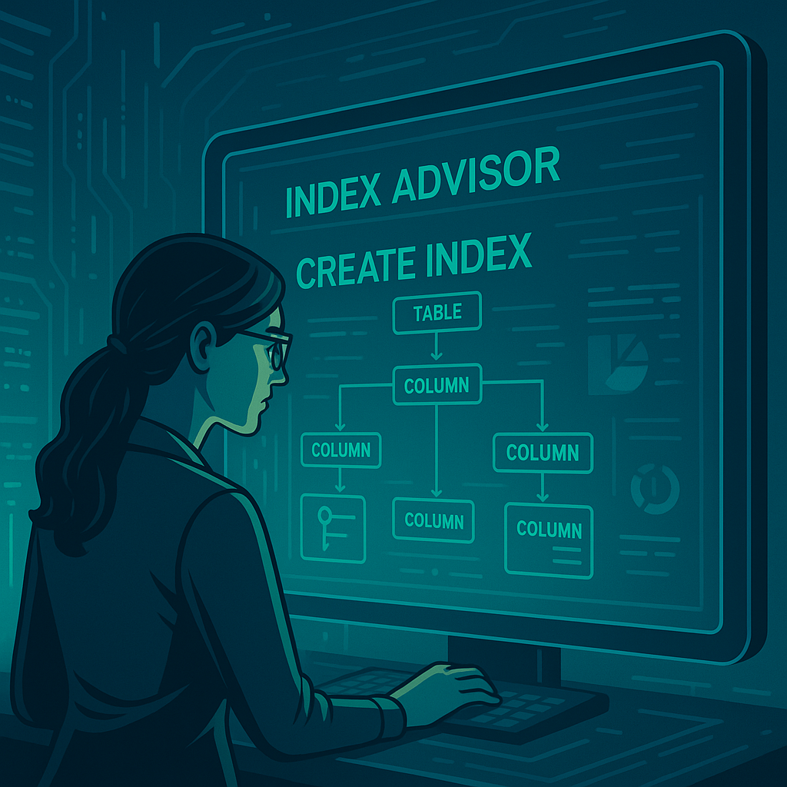
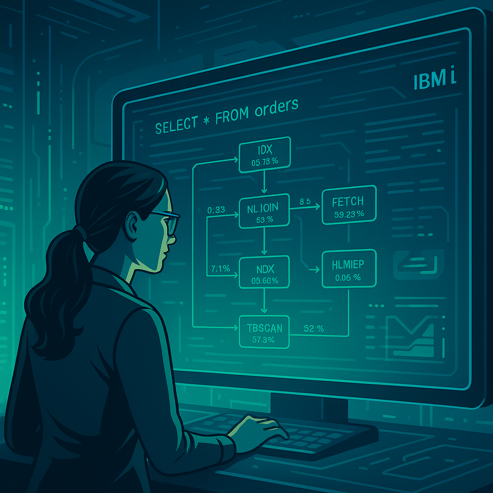

# Optimización del rendimiento de SQL en IBM i: Uso de Index Advisor y Visual Explain

En entornos empresariales que dependen del IBM i como su columna vertebral operativa, la eficiencia de las consultas SQL es crítica. Una mala ejecución de una consulta puede impactar en tiempos de respuesta, bloqueos y, en última instancia, en la experiencia del usuario y el rendimiento general del sistema.

En este artículo exploramos dos herramientas poderosas para mejorar el rendimiento SQL en IBM i: **Index Advisor** y **Visual Explain**.

## ¿Por qué es importante optimizar consultas SQL en IBM i?

Aunque DB2 for i es altamente eficiente, no está exento de problemas de performance cuando las consultas:
- No utilizan índices adecuados.
- Generan _full table scans_ innecesarios.
- Tienen filtros mal estructurados o joins mal diseñados.

La buena noticia: **IBM i cuenta con herramientas avanzadas de monitoreo y sugerencia de optimización, sin necesidad de software adicional**.

## ¿Qué es el Index Advisor?

El **Index Advisor** es una funcionalidad de DB2 for i que sugiere **índices que mejorarían el rendimiento** de consultas ejecutadas recientemente.

<figure>

<figcaption>Fig 1. Análisis de índices en IBM i.</figcaption>
</figure>

**Dónde encontrarlo:** Puedes acceder a él desde **IBM Navigator for i**, dentro del esquema de base de datos, o usando la tabla del sistema:

```sql
SELECT * FROM QSYS2.SYSIXADV
WHERE TABLE_SCHEMA = 'MI_BASE_DE_DATOS';
```

Tambien puedes filtrar por una tabla específica:

```sql
SELECT * FROM QSYS2.SYSIXADV
WHERE TABLE_SCHEMA = 'MI_BASE_DE_DATOS' AND
      SYSTEM_TABLE_NAME = 'NOMBRE_TABLA';
```

**Qué muestra:**
- Tablas que requieren nuevos índices.
- Columnas recomendadas.
- Número de veces que se sugirió el índice.
- Consulta ejemplo asociada.

**Ventajas:**
- Sugerencias basadas en uso real.
- Genera directamente el DDL del índice sugerido.
- Se actualiza dinámicamente conforme se ejecutan consultas.

## ¿Cómo interpretar las sugerencias del Index Advisor?

El **Index Advisor** en IBM i monitorea las consultas ejecutadas y detecta patrones de acceso a tablas donde un índice **habría reducido el tiempo de respuesta**, según el análisis de los planes de ejecución generados por el optimizador de DB2 for i.

### ¿Cómo consultar las sugerencias?

```sql
SELECT TABLE_NAME, LEADING_COLUMN_KEYS, TIMES_ADVISED, INDEX_TYPE, 
       SYSTEM_TABLE_SCHEMA, LAST_ADVISED
FROM QSYS2.SYSIXADV
ORDER BY TIMES_ADVISED;
```

**Columnas clave:**
- `TABLE_NAME`: tabla en la que se sugiere crear el índice.
- `LEADING_COLUMN_KEYS`: columnas recomendadas.
- `TIMES_ADVISED`: cuántas veces fue sugerido (mayor = más relevante).
- `INDEX_TYPE`: tipo de índice.
- `LAST_ADVISED`: última vez que se activó la sugerencia.

### ¿Cuándo deberías crear el índice?

- Si se sugiere con frecuencia (`>10 veces`).
- Si las columnas están en cláusulas `WHERE` o `JOIN`.
- Si no existe un índice similar.
- Si la tabla tiene un volumen medio o alto de datos.
- Si confirmas que la consulta no está usando índices eficientes (Plan Cache).

### ¿Cuándo **NO** deberías crearlo?

- Si la tabla tiene pocos registros.
- Si la columna tiene baja selectividad (valores repetidos).
- Si ya existe un índice compuesto adecuado.
- Si hay muchos índices y puedes afectar el rendimiento de escritura.

### Buenas prácticas

1. Revisa la consulta asociada (desde `Visual Explain`).
2. Prueba el índice en entorno de pruebas.
3. Usa nombres semánticos:
   ```sql
   CREATE INDEX CLIENTE_IDX_ESTADO_FECHA
   ON CLIENTE (ESTADO, FECHA_REGISTRO);
   ```
4. Monitorea luego de aplicar el índice usando `Visual Explain`.

### Ejemplo práctico

| TABLE_NAME | COLUMN_NAMES       | NUMBER_OF_TIMES_ADVISED |
|------------|--------------------|--------------------------|
| FACTURAS   | FECHA, ESTADO      | 23                       |

Consulta frecuente:
```sql
SELECT * FROM FACTURAS
WHERE FECHA BETWEEN '2023-01-01' AND '2023-12-31'
AND ESTADO = 'PENDIENTE';
```

Índice recomendado:
```sql
CREATE INDEX FACTURAS_IDX1
ON FACTURAS (FECHA, ESTADO);
```

## Uso de Visual Explain en IBM i Access Client Solutions

**Visual Explain** es una herramienta gráfica incluida en IBM i Access Client Solutions que permite visualizar de forma detallada cómo DB2 ejecuta una consulta SQL.

<figure>

<figcaption>Fig 1. Analisis de consultas SQL con Visual Explain.</figcaption>
</figure>

### ¿Para qué sirve?

- Analiza **planes de ejecución SQL** de forma gráfica.
- Muestra si se están utilizando **índices o no**.
- Permite identificar operaciones costosas como *table scans* o *nested loop joins*.
- Facilita la identificación de cuellos de botella en consultas complejas.

### ¿Cómo se accede?

1. Abre IBM i Access Client Solutions.
2. Dirígete al módulo **SQL Performance Center**.
3. Pega tu consulta SQL y ejecútala con **Visual Explain**.
4. Examina el diagrama generado para ver cada paso del plan de ejecución.

### ¿Qué debes observar?

- **Íconos rojos o amarillos** indican operaciones costosas.
- Revisa el uso de índices: si aparece *table scan* puede que necesites uno.
- Verifica los tiempos estimados y reales de cada operación.
- Puedes hacer clic en cada nodo del gráfico para ver más detalles.

### Beneficios frente al análisis textual

- Es más intuitivo que revisar solo el `PLAN_CACHE_EVENT`.
- Ayuda a explicar el problema a equipos no técnicos.
- Útil para validar mejoras tras aplicar índices o refactorizar consultas.

## Caso práctico: Identificando consultas lentas y aplicando Index Advisor

**Escenario:**  
Una consulta de facturación tarda 7 segundos en responder. Al revisarla con `Visual Explain`, vemos que hace un _table scan_ de una tabla de 5 millones de registros.

**Paso 1: Usar Visual Explain para ver la consulta problemática**

1. Abre IBM i Access Client Solutions.
2. Dirígete al módulo **SQL Performance Center**.
3. Pega tu consulta SQL y ejecútala con **Visual Explain**.
4. Examina el diagrama generado para ver cada paso del plan de ejecución.

**Paso 2: Revisar sugerencias del Index Advisor**

```sql
SELECT TABLE_NAME, LEADING_COLUMN_KEYS, TIMES_ADVISED
FROM QSYS2.SYSIXADV
WHERE TABLE_NAME = 'FACTURAS';
```

**Paso 3: Crear el índice sugerido**

```sql
CREATE INDEX FACTURAS_IDX1
ON FACTURAS (FECHA_FACTURA, ESTADO);
```

**Resultado:**  
La misma consulta ahora se ejecuta en menos de 500 ms, gracias al índice correctamente sugerido.

## Buenas prácticas para mantener el rendimiento

- Ejecuta limpiezas periódicas del Index Advisor:

```sql
CALL QSYS2.CLEAR_INDEX_ADVISOR();
```

- Evalúa índices con baja utilización.
- Automatiza snapshots del Plan Cache semanalmente.
- Usa Visual Explain en IBM i Access Client Solutions para análisis gráfico.

## Conclusión

IBM i pone a tu disposición herramientas avanzadas como **Index Advisor** y **Plan Cache Snapshots** que te permiten **detectar, analizar y corregir problemas de rendimiento SQL en tiempo real**, basados en el uso real del sistema.

No necesitas costosas herramientas externas ni migraciones a otras plataformas. Con conocimiento técnico y buenas prácticas, puedes mantener tus sistemas DB2 for i **altamente optimizados, modernos y eficientes.**